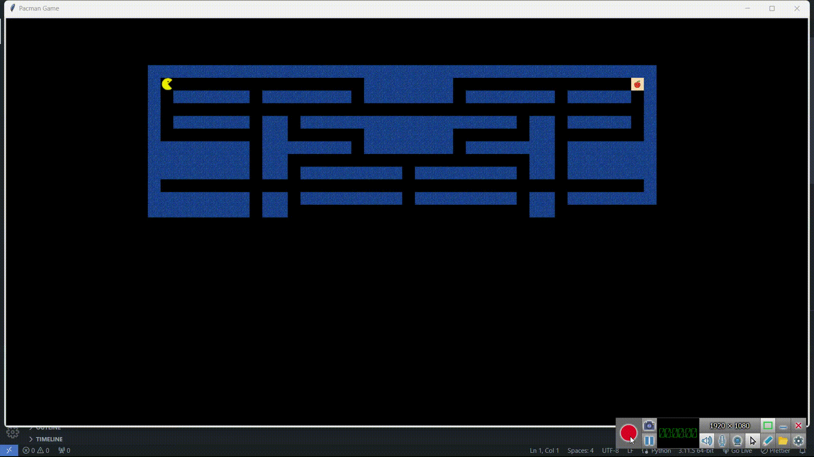

# Pacman Astar Project

This project find the shortest path between pacman position and nearest food and do it for count of foods in selected grid.

## Usage

Just run pacman.py with

```
python pacman.py
```

## Run



<p>it uses turtle library for showing the game play.</p>

## Logic

<p>Before pacman moves it realises the Manhattan distance of each food and choose it as the first in a list, then from that point; find the nearest one and append it to the list and do it in a loop and after that it starts to move.</p>

## Contact

If you have any questions or comments, please feel free to reach out to me at [faniam321@gmail.com] or [amirrezahajizadeh2002@gmail.com].
